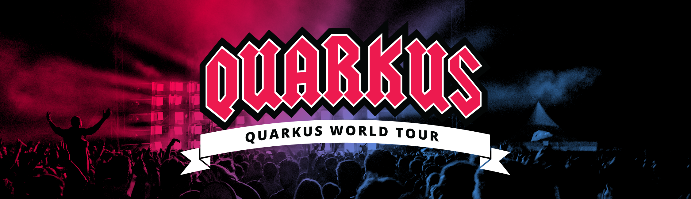
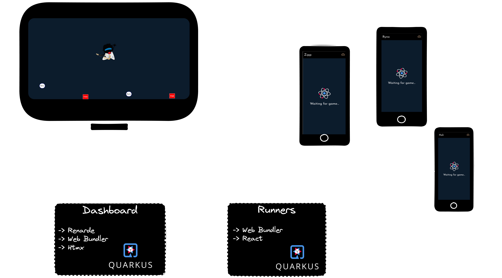
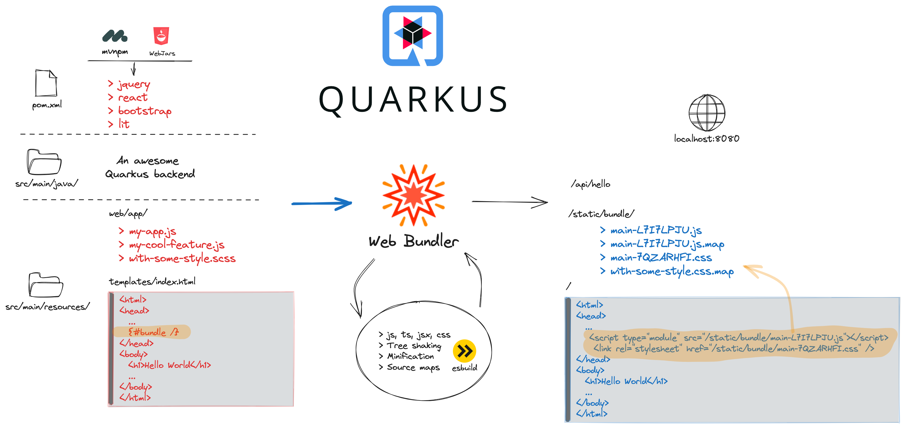
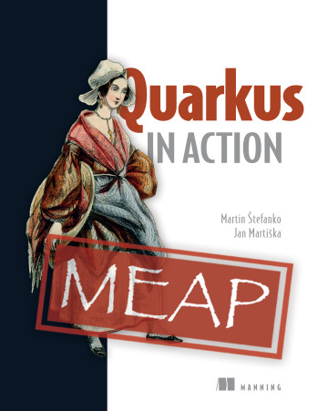
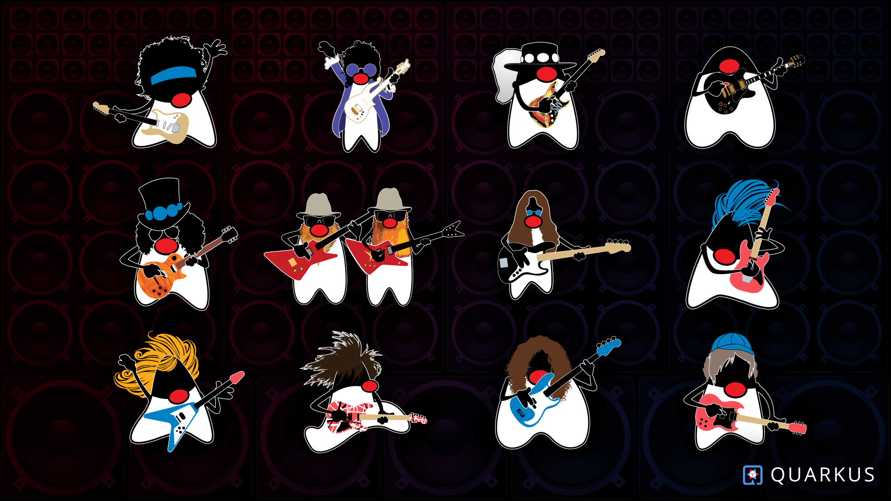

## A day in the life of a `Quarkus full-stack developer`

---

## Martin Stefanko

- Principal Software engineer, Red Hat
- BrnoJUG leader
- MicroProfile committer
- Author of Quarkus in Action
- `@xstefank`

---

## Andy Damevin

- Principal Software engineer, Red Hat
- Quarkus team for 5 years
- Lead of the Quarkus Web team
- `@ia3andy`

---

### What is Quarkus?

- Open Source Cloud-Native Java framework
- Tailored for both the JVM and native (GraalVM)
- Build time vs Runtime processing (extensions)

---

### What can Quarkus offer?

- Lower memory usage and faster startups
- Easy containerization and cloud deployments
- Community and Standards
- Developer Joy

---

### What can we create with Quarkus?

- Cloud-Native, Serverless, Micro-Services, Command-Lines…
- Monolith 👻
- And Web Applications!

---

<!-- .element width="60%"  -->

[red.ht/one-two-three-quarkus](red.ht/one-two-three-quarkus)

---

<!-- .element width="100%"  -->

---

<!-- .element width="100%"  -->

---

### One game isn't fair...

- Let's add a database
- Average the results through multiple games

---

```java
System.out.println("""
    ```java
      System.out.println("How about coding now? 🤓");
    ```
""");
```

---

# A chance to win?!

---

### 3 codes for Quarkus in Action book!
 
<!-- .element width="40%"  -->

---

### Rocking dukes for your laptops!

<!-- .element width="80%"  -->

---

<!-- .element width="60%"  -->

[red.ht/one-two-three-quarkus](red.ht/one-two-three-quarkus)
